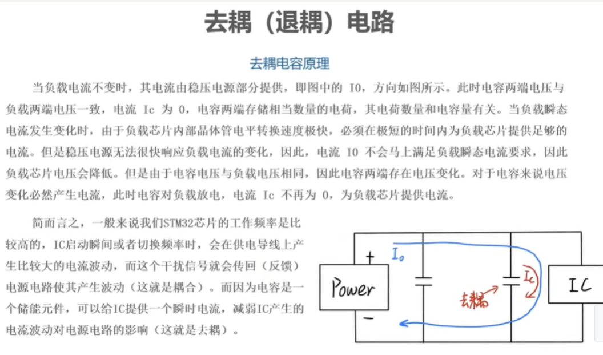
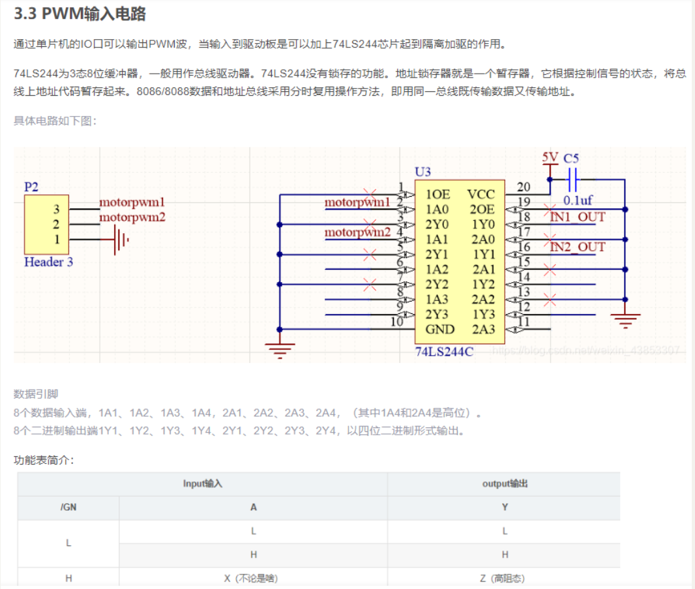
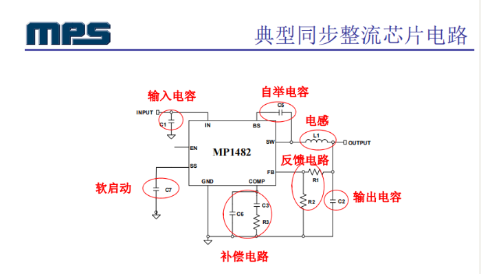
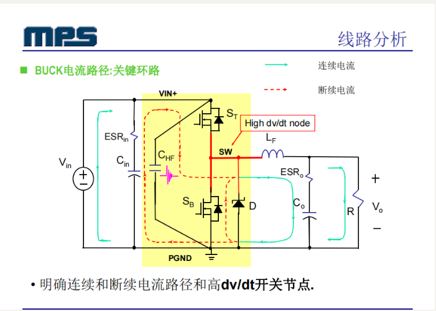
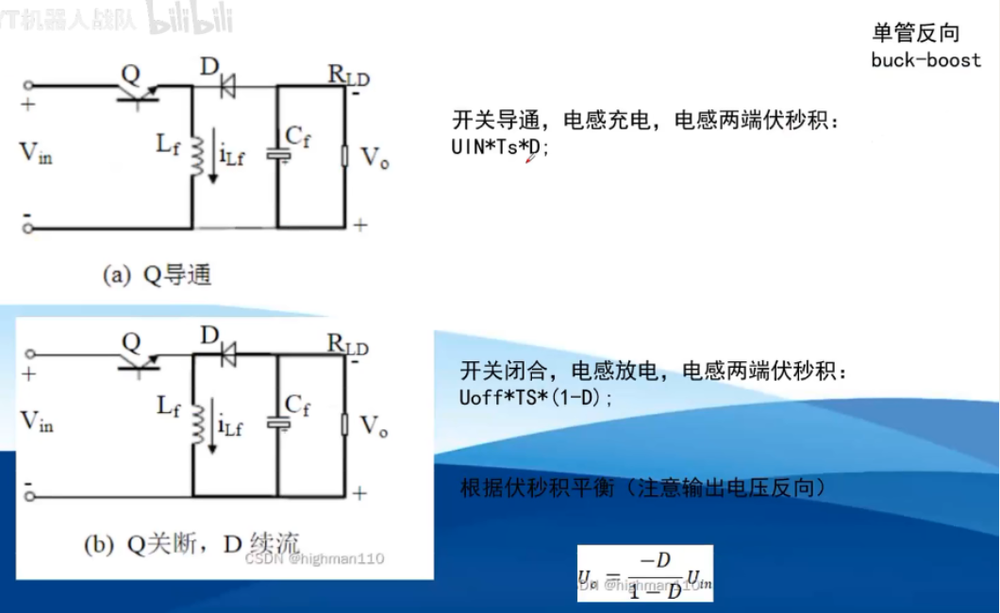
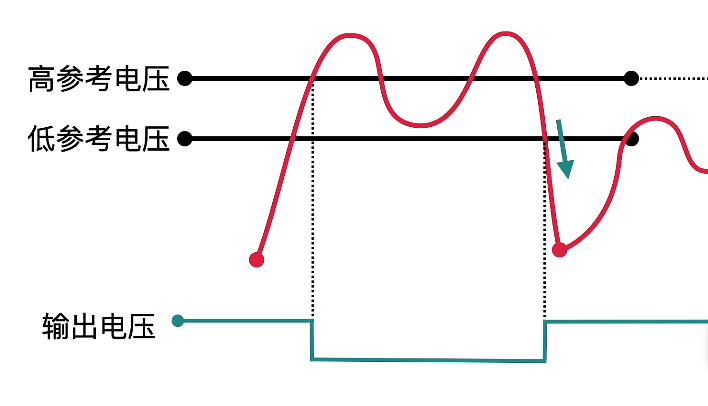

# 智能车硬件电路

## 1.主板

### 单片机

电源电路/复位电路/晶振电路/程序下载电路/调试电路/外设电路/启动方式  

### 主板电源

#### 舵机电源

##### AS1015

舵机电源采用的是AS1015方案,新型高效率电源稳压芯片，内部采用P-MOSFET取代老式的LM2576、LM2596、LM2941等芯片。参考一下技术手册的原理图与主板原理图,大致差不多。
技术手册的原理图与主板原理图如下：
对比技术手册原理图可在输出端加一个反馈，用于调节PWM占空比。可以把R2换成一个1K变阻器，就可以实现电压调节了。D1用肖特基二极管(SS54)，高频特性好且导通压降低。
实测效果，跟LM2596-ADJ相比：供电：12V电池，输出稳定在6.5V；负载：38KG大力舵机；测试方法：快速左右转动，空载测试；压降：AS1015电压一直保持在6V以上，LM2596-ADJ则会降到4.5V左右，压降相对更小比较小。因为驱动舵机需要6V的电压,AS1015的稳定性最好所以非常推荐。

#### 5V电源

##### LM2940

5V电源采用的是LM2940,是一种非常常见的电源方案。LM2940是输出电压固定的低压差三端稳压器；输出电压5V；输出电流1A；输出电流1A时，最小输入输出电压差小于0.8V；最大输入电压26V；工作温度-40～+125℃；内含静态电流降低电路、电流限制、过热保护、电池反接和反插入保护电路。
原理图如下

这里对电路进行一下解释,采用SS54是为了防止电池反接,这里采用的220uf为钽电容(封装7343E),因为容量大所以封装相对较大,所以购买元器件的话要注意一下,选择钽电容虽然质量好一点但价格也是有点小贵的哦,大家注意。

可能有人发现GNDBAT与GND5V之间的回路中有一个0R的存在这是有特殊目的的,具体参考一下下文：

模拟地和数字地单点接地只要是地，最终都要接到一起，然后入大地。
如果不接在一起就是”浮地”，存在压差，容易积累电荷，造成静电。地是参考0电位，所有电压都是参考地得出的。
地的标准要一致，故各种地应短接在一起。人们认为大地能够吸收所有电荷，始终维持稳定，是最终的地考点。
虽然有些板子没有接大地，但发电厂是接大地的，板子 上的电源最终还是会返回发电厂入地。
如果把模拟地和数字地大面积直接相连，会导致互相干扰。不短接又不妥，理由如上有四种方法解决此问题：
1、用磁珠连接； 磁珠的等效电路相当于带阻限波器，只对某个频点的噪声有显著抑制作用，
使用时需要预先估计噪点频率，以便选用适当型号。对于频率不确定或无法预知的情况，磁珠不合。
2、用电容连接； 电容隔直通交，易造成浮地。
3、用电感连接； 电感体积大，杂散参数多，不稳定。
4、用0 欧姆电阻连接； 0 欧电阻相当于很窄的电流通路，能够有效地限制环路电流，使噪声得到抑制。电阻在所有频带上都有衰减作用(0 欧电阻也有阻抗)，这点比磁珠强。

这里的5V电源的目的是给摄像头电源，运放电源，无线串口，与TTL提供输入。

#### 3V3电源

##### RT9013

3V3电源采用的是RT9013-33，RT9013属于集成电路IC，它是一款高性能、输出电流能力 500mA 的线性稳压器，提供极高的 PSRR 和 超低压降，非常符合可携式 RF 和无线应用的效能和大小需求。静态电流可低至 25μA，来延长电池的使用寿命。
技术手册的原理图与主板原理图如下：

2.4 运放电源（RT9013-33V）

运放电源采用的也是RT9013方案，具体参考3V3电源方案，因为运放电源是将VCC5V向VCCOP转换，所以也要加上磁珠或0欧姆电阻。

运放电源原理图如下：
[

2.5 摄像头电源（RT9013-33V）

摄像头电源采用的也是RT9013方案，具体参考3V3电源方案，因为摄像头电源是将VCC5V向VCCCAM转换，所以也要加上磁珠或0欧姆电阻。

摄像头电源原理图如下：

## 2.驱动

### IR2104

原文链接：https://blog.csdn.net/weixin_43853307/article/details/113501703
直流伺服电机具有优良的速度控制性能,它输出较大的转矩,直接拖动负载运行,同时它又受控制信号的直接控制进行转速调节。在很多方面有优越性,具体来说,它具有以下优点:
1.具有较大的转矩,以克服传动装置的摩擦转矩和负载转矩。
2.调速范围宽,高精度,机械特性及调节特性线性好,且运行速度平稳。
3.具有快速响应能力,可以适应复杂的速度变化。
4.电机的负载特性硬,有较大的过载能力,确保运行速度不受负载冲击的影响。
5.可以长时间地处于停转状态而不会烧毁电机,一般电机不能长时间运行于停转状态,电机长时间停转时,稳定温升不超过允许值时输出的最大堵转转矩称为连续堵转转矩,相应的电枢电流为连续堵转电流。

采用的是1117-5。AMS1117是一个低漏失电压调整器，它的稳压调整管是由一个PNP驱动的NPN管组成的，漏失电压定义为：VDROP=VBE+VSAT。AMS1117有固定和可调两个版本可用，输出电压可以是：1.2V，1.5V，1.8V，2.5V，2.85V，3.0V，3.3V，和5.0V。片内过热切断电路提供了过载和过热保护，以防环境温度造成过高的结温。

为了确保AMS1117的稳定性，对可调电压版本，输出需要连接一个至少22μF的钽电容。对于固定电压版本，可采用更小的电容，具体可以根据实际应用确定。通常，线性调整器的稳定性随着输出电流增加而降低。

AM1117-5的电路图部分：

升压电路采用的是MC34603,MC34063是一单片双极型线性集成电路，专用于直流-直流变换器控制部分。片内包含有温度补偿带隙基准源、一个占空比周期控制振荡器、驱动器和大电流输出开关，能输出1.5A的开关电流。它能使用最少的外接元件构成开关式升压变换器、降压式变换器和电源反向器

MC34063升压电路：从5V升到12V：

电源部分小结：通过AMS1117-5模块将电池的电压稳定在5V,并输送给MC34063用于升压。MC34063输出的12V电压用于提供给后面的H桥电路。

关于H桥电路的设计主要用到了IR2104半桥驱动芯片和IR7843[MOS管](https://so.csdn.net/so/search?q=MOS管&spm=1001.2101.3001.7020)。
H桥电路整体原理图如下：

2.IR2104半桥驱动芯片

所谓半桥驱动芯片，便是一块驱动芯片只能用于控制H桥一侧的2个MOS管。因此采用半桥驱动芯片时，需要两块该芯片才能控制一个完整的H桥。

相应的，全桥驱动芯片便是可以直接控制4个MOS管的导通与截止，一块该芯片便能完成一个完整H桥的控制。

这里使用的IR2104便是一款半桥驱动芯片，因此在原理图中可以看到每个H桥需要使用两块此芯片。

IR2104经典电路设计如下：

IR2104的各个引脚功能：

VCC为芯片的电源输入，手册中给出的工作电压为10~20V。
IN和SD作为输入控制，可共同控制电机的转动状态(转向、转速和是否转动)。
VB和VS主要用于形成自举电路。
HO和LO接到MOS管栅极，分别用于控制上桥臂和下桥臂MOS的导通与截止。
COM脚直接接地即可。

### BTN7960

电机作为整辆车动力的核心，其工作是否正常是整个智能车系统的关键。如果电机驱动这部分硬件电路处理的不好，甚至输出参数十分玄学，那么在软件层面无论使用再好的速度决策，再先进的控制算法都将收效甚微，硬件的差距始终是难以从算法上得到弥补的。

在介绍电机驱动之前，不妨先看看这个问题：我们为什么需要电机驱动？

**知识补充1：**主控对于智能车速度层面的控制，归根结底是对于电机的控制，电机的转速直接决定车的速度，而直流电动机转速由加在电机上的电压（电压有效值）决定，这样我们就建立起了一个电压有效值-->电动机转速-->车速的线性关系式。

**知识补充1.5**：电机的启动电流会非常大，可能会达到工作电流的几倍，如果是带载硬启动的话其启动电流可能会更大。像越野车使用的540电机其启动电流理论值是2A左右，但我们车实测可能会达到16A以上（堵转电流≥35A）。

**知识补充2：**单片机通用IO口的带载能力普遍较弱，以我们的好朋友STM32f103zet6为例，他的io的极限电流输入/输出参数只有20mA，超过这个限额的电流将会导致单片机io口的损坏，即失去输入输出能力，严重情况下甚至会导致单片机彻底损坏。

**知识点补充3：**现阶段智能车大赛中所有车模均采用直流永磁电动机作为车模的动力来源，主流调速方案为PWM调速。PWM调速可以理解为将驱动器输出的方波进行单周期的有效值计算（求积分）然后逐周期顺序施加在电动机上。

也可以简单地理解为：有效电压=驱动输出的高电平电压*占空比

通过这三条补充的知识点可以看到，我们如果想要通过PWM调速的方式来控制电动机运转，直接把单片机io口与电机相连肯定是不行的，我们需要一个能将单片机发出的控制信号进行放大与隔离的电路。

这也就是电机驱动电路存在的必要性。

7960是一个支持大电流输出的半桥电机驱动芯片，可以理解为是一个很耐操的单路PWM功率放大器，它有一个供电引脚（VCC:-0.3~45V；），一个功率输出引脚（接电机，输出PWM高电平为供电引脚的输入电压），一个逻辑输入引脚（兼容3.3V、5V两种逻辑电平），一个使能引脚、一个压摆率控制引脚。这是他的引脚定义与引脚用途

让我们一个一个的来讲解每个引脚的作用

1脚：接地，驱动半桥系统的电流回路地
2脚：信号输入，单片机输出的方波信号的接收引脚
3脚：可以理解为芯片的使能（选通）引脚。
4脚、8脚：这两个引脚是内部相连的，是接电机的驱动输出引脚。
5脚：压摆率控制引脚，可以理解为驱动支持的信号频率控制。
6脚：电路故障检测与诊断引脚。
7脚：电压输入引脚，供电。

1、如何实现信号的隔离？

在讲解实现隔离的方法之前，先说一下为何要把驱动芯片与单片机之间加以隔离。

前文说过，单片机io口所能忍受的灌、拉电流的量是很小的，但其所控制的电机驱动可是动辄以十几安培为计的功率部分，所以为了保护单片机不被功率部分的大电流所损坏，一定形式上的保护隔离措施是很有必要的。除此之外，使用隔离器件还有改变驱动电平的作用。

（其实保护的必要性应该视具体情况而定，这样子泛泛而谈其实是不太准确的，后期会出一篇专门讨论驱动保护的文章。）

能想到的隔离其实不外乎两大类，光耦隔离与逻辑隔离；光耦隔离主要是指使用专门的光耦隔离芯片，通过其内部电－>光－>电的转换来实现电路拓扑上的隔离，也就是输入信号与输出信号之间是通过光而不是电来承继的，所以也就实现了隔离的作用。

逻辑隔离是我自己编的名字~~~~不过还是挺形象的，字面意思也就是通过逻辑器件来实现隔离，这里会用到两大类器件，分别是逻辑门与运放（一般都是逻辑门）。主要思想就是通过这些门电路与运算放大器输入输出之间的高阻抗的关系来实现将输入与输出之间的隔离。

光耦分两种，有集成芯片形式的，比如大名鼎鼎的TLP250，这一类芯片需要单独的供电，并且其本身作为一个驱动器他是有驱动能力的，单纯的用于输入输出隔离其实是有一些大材小用的。还有另一类光耦是那种四个引脚，单纯实现光耦隔离的器件，在我们这种驱动场景下，如果选择光耦则选用第二种其实就够用了。

同样的，逻辑隔离一般使用集成逻辑门芯片来实现，运放驱动能力太弱，一般不做此使用。我们这次采用了一款TI出品的三态逻辑缓冲器74LS541来实现输入输出之间的隔离。

使用5v供电的541的确有转换逻辑电平的作用，这一点我忘记说了，感谢提醒！
一般来说，功率部分与控制信号部分的隔离是设计上的必须，而不是功能上的必要。举个例子，在eg2104驱动mos管构成H桥的电路中，如果直接将单片机的控制电压信号输入到驱动器，一般（轻载，无硬启动或反向）的情况下，信号直接输入是没有问题的，但在重载或者驱动感性负载情况下，则会有灌流问题，即单片机逻辑输入低的情况下，因为芯片自身的特性，输入引脚会存在反向流出电流的情况，如果不存在隔离，则这个电流是有可能导致单片机损坏的。
对于BTN7960的设计来说，光耦的设计更加常见，比如龙邱科技的电机驱动板，就是使用了光耦隔离的方案。这种设计不仅可以提高安全性，更可以在系统出现问题时减小损失

### EG2104

栅极驱动器
常用的mos管驱动电路结构如图1所示，驱动信号经过图腾柱放大后，经过一个驱动电阻Rg给mos管驱动。其中Lk是驱动回路的感抗，一般包含mos管引脚的感抗，PCB走线的感抗等。在现在很多的应用中，用于放大驱动信号的图腾柱本身也是封装在专门的驱动芯片中。本文要回答的问题就是对于一个确定的功率管，如何合理地设计其对应的驱动电路如驱动电阻阻值的计算，驱动芯片的选型等等。

注：若无特别说明，一般以驱动单个mos为例。

图中的Rpd为mos管栅源极的下拉电阻，其作用是为了给mos管栅极积累的电荷提供泄放回路，一般取值在10k~几十k这一数量级。由于该电阻阻值较大，对于mos管的开关瞬态工作情况基本没有影响，因此在后文分析mos的开关瞬态时，均忽略Rpd的影响。

注意，这个电阻在驱动电路的工作状态下是不起主要作用的，而是在电路停止工作的一瞬间，由于栅极电位是无法确定的，若MOS正在处于被驱动开通的状态，则其栅极会积累一定的电荷，假设此时断电，则处于高阻态的栅源极会导致这部分电荷一直被存储，就有可能会在电路下次启动的瞬间导致MOS的误开通或者栅极的击穿，为防止此类现象产生，则加一颗电阻下拉用于泄放电荷，起到保护栅极的作用。

注2：图中Cgd，Cgs，Cds为mos管的三个寄生电容，在考虑mos管开关瞬态时，这三个电容的影响至关重要。

首先，给出一个较为成熟的半桥驱动芯片驱动MOS管的电路，这个电路经实测可以输出几乎不失真的波形，让我们以这个图为例，看看如何一步一步确定每个元器件的值：

### DRV8701

！！！请一定熟读DRV8701芯片手册！！！

2S供电时-VCP 电荷泵14-16V	MOS管下半桥栅极对地电压5.8V左右
3S供电时-VCP电荷泵20V左右   MOS管下班桥栅极对地电压9.2V左右
具体参见芯片数据手册。检查DRV8701首先检查VIM858与VCP输出。若电荷泵输出正常，则芯片工作正常

DEBUG
1.可以先检测MOS管的栅极对地电压。若此处正常，说明之前芯片部分是良好的。可以拆    卸掉MOS管，只测DRV的VCP引脚。此时芯片可以测出电荷泵电压，但是由于MOS管未安装，无法测出栅极源极驱动电压

2.不要拆一路MOS测另一路MOS，有可能会误操作导致另一路MOS管烧毁

3.如驱动出现嗡嗡响声，可能是短路原因，首先拆MOS管，大概率MOS管穿了

4.此外隔离芯片要注意，可能会有不工作的情况。输入PWM，要检测该引脚是否确定有PWM输入，若输入PWM但是该引脚电压一直为0，则隔离芯片被拉低检查焊接或者更换隔离芯片。

## 3.电源 

### 无线充电

#### 恒压

LC谐振之后，4个二极管整流后直接给电容，因为这里的接受电压恒定，所以叫恒压
缺点是理论比较慢			

#### LCC恒流

LCC谐振后，4个整流二极管直接接给电容，保证给到电容的电流恒定，比LC理论上快
缺点是条获赠LCC参数比较繁琐 

#### 恒功率

主体是LC傻充，但是不是整流之后直接接给电容，而是加了一个驱动电路，可以使用PWM控制给到电容的电压，然后还有一个电流检测芯片，通过AD值采集电压和电流，可以知道功率从而PWM控制功率，理论上最快
缺点：电路复杂，考验PCB能力

### LDO

工作原理：
稳压二极管使得该点点位钳位在3.3V。
运算放大器作为比较器，当Vf>Vs时，三极管基极电压增大，电流也增大。
Vout=5V，超过5V的时候，Vs电压升高，导致Vs>Vf从而运放输出电压减小从而负载电压下降，回到5V小于同理

线性稳压电源：输出纹波小，需要外围元件少，效率低，12V降5V，剩余7V会加在三极管上，若通过大电流发烫严重。

由运算放大器一直在执行采样控制的功能。

ldo内部等效电路，VT是一个调整管，可以看作是个可调电阻。

基于这个知识点，我们再回头来看这三种方案。

方案一：负责3.3V输出的LDO与需要5V供电的外设共同与5V输出的LDO相串联，过重的负载会导致前级（LDO-5v）需要输出的电流大，这会导致它的性能下降，并且严重发热，长时间工作下会变得不稳定。并且由于是串联关系，任何一个芯片出问题都会导致整个系统的损坏。

方案二：负责输出3.3V的LDO与前级压差过大，导致大部分能量都以热能形式在一颗LDO上耗散，不仅效率低，并且发热点集中，不利于散热。

方案三，通过在3.3v输出支路加入了一个5V的ldo进行缓冲，分散了发热源，减轻了后级压力，并且不受另一支路的影响。

很明显，第三种方案虽然也有缺点，比如没有解决效率低下这个问题，但仍是三种方案中的最优解。

所以我们的电路方案就变成了这样子：

### BUCK

##### BUCK开关电源原理

开关闭合，二极管截止，电源开始给电感电容储能，同时给负载供电，电感为了阻止电流的改变，会感生出一个与电源电压相反的电压，电感会抵消一部分电压，使得负载端电压达不到12V限制在5V，随着时间增加，电感上电压渐渐减小，负载电压渐渐增大，因为通过电感电流如果没有变化，电感就相当于导线。电容起到了储能和滤波的作用，没有电容，波形会变得很尖锐。实际电路当中利用晶体管代替开关。在该电路当中，电感的等效电阻，电容的等效电阻，二极管的导通压降，晶体管的导通电阻都是产生损耗。

##### 自举电容

##### BUCK—MP1482

异常主要原因：静电/高温/虚焊/元件缺损/错料/PCB做错

### BOOST

​								  

断开开关时，负载阻抗比之前大，电流顺时针流。导线阻抗很小，右侧阻抗较大，负载阻抗比之前大，电感上的电流比之前少，此时电感为减少电流减少，电流也顺时针流动，电感感生出的电压与电源一致，二者会叠加，从而负载侧电压升高接近12V，此时电源给点哦人能够和负载供电。

打开开关的时候，负载阻抗 瞬间减小，此时电感电流瞬间增大，此时电感感应出的电压和电源电压相反，二极管左侧电位小于5V，二极管是截止的，电容只给负载供电，电容容量不要太小

实际电路是晶体管代替开关

升压电路只能升高电压，电流必然会下降。为了保持功率恒定。

### AC/DC转换

##### 整流 

AC-DC
输入交流电 串联一个二极管 一半被滤除 半波整流
四个二极管组成整流桥 全波整流 
全波整流基础上再加一个电容 使得波形变得平滑 接近直流电

##### 逆变

直流电变交流电DC-AC
方波交流电不能带感性/容性负载
方波->正弦波 增加更多的开关次数 再使波形变平滑
电容相当于一个水库 能把断断续续的水接进来 再平缓的放出去

### 电流采样

## 4.电磁与运放

### 电磁信号采集

### 电磁信号放大

### 电磁信号检波

### 电磁元件选型

OPA4377
OPA2350
AD8674+INA129

## 5.电机

### H桥直流电机

慢衰减模式与快衰减模式

#### 快速衰减模式

我前面提到的直流电机项目要求电机在禁用时会在特定位置快速停止。因此，鉴于这一要求，我确信，起初，采用快速衰减模式是我需要的。可以合理地假设“快速衰减”对应于快速减速。我错了。在阅读了这个问题之后，我意识到*术语慢衰减*和*快速衰减*与流过电感器的电流有关，与直流电机的行为没有直接关系。

总结一下这一点：不要认为快速衰减会迅速停止电机，因为实际上恰恰相反。

名称“快速衰减模式”是指该模式允许电机的线圈电流非常快速地衰减到零。下面的图 2 描述了源自 V 的电流.bat然后经过Q1，电机绕组，Q4到达地面节点。在这种情况下，电机通电并正常转动。

 

***图2.**电机通电并正常转动。*

 

如您所知，通过电感器的电流（如电容器两端的电压）不会瞬时改变。如果我们禁用Q1和Q4，电流将继续流过反激二极管或FET体二极管;该电流将逐渐衰减到零。快速衰减模式是一种使用FET而不是二极管为这种衰减感性电流提供路径的技术。下面的图 3 显示了启用的 Q2 和 Q3，而 Q1 和 Q4 都禁用了。

 

 

通过驱动Q2和Q3导通，我们再次将源电压施加到电感上，但极性相反，即极性促使感性电流更快地衰减。

不要忘记，射门是一个很大的禁忌。因此，我们必须先禁用一个 FET，然后再启用另一个 FET——我们必须“先开后合”。幸运的是，在使用 DRV8801 和其他电机驱动器芯片时，我们不必担心这种先断后合的舞蹈，因为它是由 IC 自动处理的。

最后，根据您的应用，可能不需要使用快速衰减模式。相反，您可以选择简单地使用上述反激二极管或体二极管。然而，二极管何时开始导通的时间尚不清楚，这在您的应用中可能很重要，也可能不重要。根据[TI的社区支持页面](https://e2e.ti.com/support/applications/motor_drivers/f/38/p/263764/923160?tisearch=e2e-sitesearch&keymatch=fast decay vs. dead time#923160)，“一般来说，高电感电机，高运行速度[或]高度的微步进通常需要快速衰减，所有这些都需要电流快速变化。此外，如果FET的[导通电阻](https://www.allaboutcircuits.com/technical-articles/understanding-mosfet-on-state-drain-to-source-resistance/)导致压降低于二极管的正向电压，则快速衰减模式可以降低功耗。

 

***图4.**作为快速衰减模式的替代方法，您可以使用体二极管或外部反激二极管为衰减感性电流提供路径。图片由[TI 的 SLVA321 应用笔记提供（图 3）。](https://www.ti.com/lit/an/slva321/slva321.pdf)*

#### 慢衰减模式

让我们重新审视一下图 2 电机正常运行的位置。现在，我们不再像快速衰减模式那样打开Q2和Q3并关闭Q1和Q4（图3），而是禁用Q1并启用Q2（见下面的图5）。

*注意：低侧FET或两个高侧FET都可用于慢衰减模式。*

 

***图5.**Q2 和 Q4 已启用（慢衰减模式）。*

 

电感的电流在以再循环方式通过Q2和Q4时降至零。在这种情况下，没有施加电压迫使电流快速放电;相反，电流在流过电感的电阻和两个FET的导通电阻时以热量的形式消散。

尽管电流衰减较慢，但此模式可更快地降低电机速度。当直流电机旋转时，它会产生反电动势。我们可以将其视为电机惯性或储存能量的表现。在快速衰减模式下，尽管电流快速衰减，但随着存储的能量逐渐消散，电机将滑行至零角速度。

当我们启用Q2和Q4时，我们在两个电机端子之间创建了一个低阻抗路径。这基本上使反电动势短路，从而使电机存储的能量更快地消散。结果是快速减速，以至于术语“制动”与缓慢衰减模式相关联。

所以请记住，“慢”和“快”这两个名称与通过感性负载（例如电机绕组）的电流衰减率直接相关，而不是与电机角速度的降低有关。

#### 总结

快速衰减模式可快速降低感应电流，并允许电机滑行至零速度。慢衰减模式导致感性电流降低较慢，但会产生快速减速。

下面的图6总结了这两种衰减模式的电流路径。

 

***图6.**DRV8801 中的电流路径。图片由[TI 的 DRV8801 数据表提供（第 14 页）。](https://www.allaboutcircuits.com/electronic-components/datasheet/DRV8801PWPR-Texas-Instruments/)*

# PCB设计

## 四层板

四层板分层：信号 GND POWER 信号
开关电源
双面板：所有走线在顶层走完，底层完全覆铜到GND，至多走2-3条线
四层板：所有走线在顶层 走完，其余三层完全覆铜到GND

双层板改四层板VCC经过10UF+0.1UF电容再进入IC 小容量电容靠近芯片

另外需要打两个过孔分别到VCC GND 电流回路面积约等于0

电容与过孔摆放位置，过孔在外侧 滤波电容-频率越电容越小

## BUCK

## LDO

电容选型：贴片电容高频滤波优于铝电解电容 
给芯片供电，高频干扰影响正常工作
实际电容等效为RLC R即ESR L即ESL
铝电解电容的寄生电感较大 不适合高频滤波 容值大用于储能

器件布局：滤波电容紧靠芯片管脚
电流路径先过电容再进芯片/从芯片出来也是先过电容再出芯片

## SI/PI

## EMC/EMI

# 元器件

## 电容 

### ESR/ESL 

DC-DC纹波解决办法

电容发烫 说明ESR偏高
可以并联一个电容解决 陶1瓷电容->电解电容
降低纹波->串联磁珠和电容 注意磁珠的额定电流

低通滤波降低纹波
RC低通 RL低通 LC低通

### 旁路/去耦电容

常见的0.1uf 0.01uf
实际电容制造可能是ESR ESL C三者的集合 (串联等效电阻 串联等效电感 理想电容)
ESR ESL是由电容的制造工艺和材料决定的
ESR影响电源的纹波 ESL影响电容的滤波频率特性

旁路电容 Bypass Capacitor
去耦电容 Decoupling Capcitor 
一定程度上 电容越大 滤波效果越好
对一个特定电容 
当信号频率低于其自谐振频率时呈容性
当信号频率高于其其自谐振频率呈感性
用0.1uf和0.01uf并联相当于拓宽了滤波频率范围

去耦的两种方式
多个相同100nf并联
大小电容并联10uf+100nf

电源输入 交流噪音+直流负载电流 
旁路电容将交流噪声滤除 将直流负载电压给到IC
滤波电容用来滤除低频扰动 取值在10uf以上
旁路电容用来滤除高频噪声 一般取值在1uf以下 铝电解电容/瓷片电容

### 安规电容

 电容可分为 铝电解电容 钽电解电容 聚酯电容X  瓷片电容Y
安规电容分为X电容和Y电容(内部介质不同)
安规：通过安全规范测试认证 符合国家安全标准 电容失效不会起火

安规电容主要信号就是对干扰信号进行滤波 不滤除220V交流电 滤除的是高频干扰
X电容滤除差模干扰 Y电容滤除共模干扰 相位差
电容充电是因为存在电势差
电解电容人能够最主要的作用是滤波 但此处不可用 
电解电容只允许加正向电压 给电解电容加220V交流电会爆炸
常规的聚酯瓷片电容不能代替安规电容

标称X电容250V 实际耐压2500V
标称Y电容250V 实际耐压5000V

### 陶瓷电容

MLCC Multi layer Ceramic Capacitors多层陶瓷电容(也叫独石电容也是陶瓷电容)
陶瓷电容包括瓷片电容和独石电容
瓷片电容由一层电极和一层电解质构成
独石电容由几层电容和电解质构成
独石电容容量远大于瓷片电容 但是耐压远不如瓷片电容

MLCC独石电容的作用 滤波 旁路 耦合
仅应用于小功率场景 因为耐压低 
容量0.5pf~100uf 额定电压小于100V

### 铝电解电容

旅电解电容内部电介质为铝电解液 外壳也是铝制
电解电容一般区分正负极 一般应用于低频直流电场合 主要给电源滤波 使波形平滑

### 钽电容

钽电容也是电解电容一种 内部电解质填充的是钽的固体化合物
应用场景：铝电解电容内部液体 长期高温可能会蒸发干 钽电容可以解决这一问题
第二个就是对体积要求比较苛刻

### 薄膜电容

采用电介质是塑料薄膜 薄膜表面涂抹一层金属形成一对电极 不区分正负极
可分为聚酯 聚苯乙烯 聚丙烯
经常可以被替代 仅用于220V交流电场景

## MOS管

米勒效应

Cgd米勒电容

## 电感

## 二极管

# 硬件知识

## ADC

模数转换器 模拟量是连续无穷尽的 数字量是离散的
 数字量和模拟量之间存在一定的偏差
电压表就是将模拟量转化为数字量

ADC分为并联比较型AD 计数型AD 主次逼近型AD 双积分型AD
并联比较型AD转化速度最快

## 施密特触发器

施密特触发器可以将模拟信号转化为高低电平信号
电压波形不平滑 由于噪声一直会上下波动			
			

为了消除噪声 在比较器的基础上加上一个电阻变成了迟滞比较器
施密特触发器有高参考电压 也有低参考电压
输入电压大于高参考值 输出低电平 输入电压小于地参考电压 再输出高电平
本质上也是只有一个参考电压 只不过根据输出电压的不同在不同时刻有不同的值

## 锁相环

## 晶振

有源晶振：自行谐振
无源晶振：需要外围电路 皮尔斯振荡器 反向放大器

晶振等效为静态电容+等效电容 等效电感 等效串联电阻

32.768KHz为了RTC实时时钟 32378=2^15 一般RTC时钟需要一个电池供电通过IIC与MCU通信

晶振的测量

## LC谐振

LC谐振实质是电容和电感能量的转化
电容将电能转化为电感的磁能
电感将磁能转化为电容的电能

电感储能公式W=1/2 * CU^2
电容储能公式W=1/2* LI^2

电感U=L*di/dt
电容I=C*dU/dt

处于谐振频率时 总阻抗最低 频率接近0Hz时阻抗无穷大 电容通交隔直 频率无穷大时 电感阻碍电流通过
发生谐振时 电容和电感实现能量转换 电场能和磁场能实现了互相转换 此时LC相当于短路 电路中阻抗只有R
